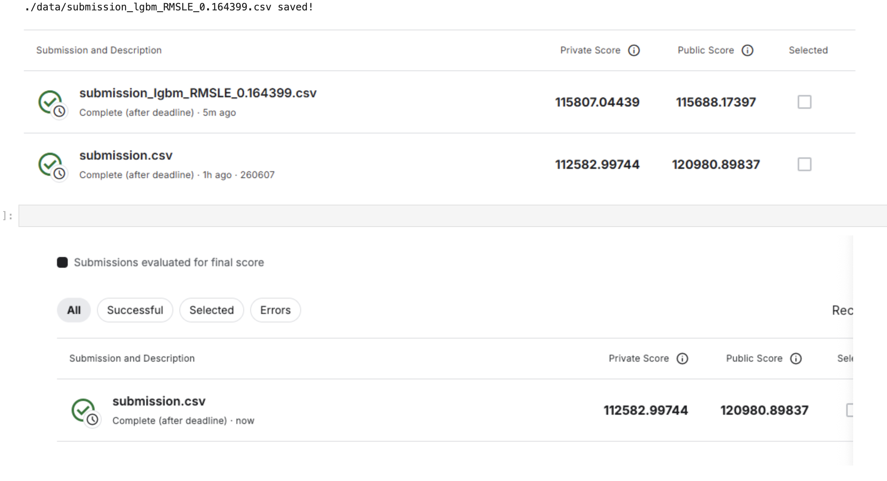
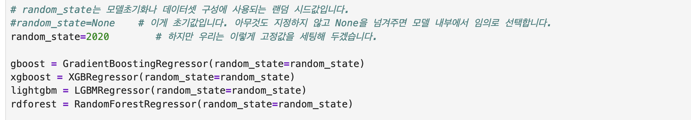
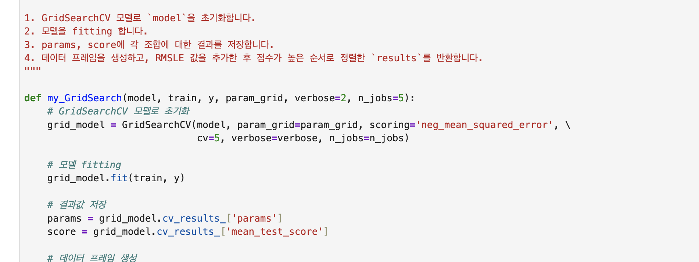

# AIFFEL Campus Online Code Peer Review Templete
- 코더 : 최병철
- 리뷰어 : 강경수


# PRT(Peer Review Template)
- [x]  **1. 주어진 문제를 해결하는 완성된 코드가 제출되었나요?**
    - 문제에서 요구하는 최종 결과물이 첨부되었는지 확인
        - 중요! 해당 조건을 만족하는 부분을 캡쳐해 근거로 첨부

- 결과 값이 csv 파일로 저장되어 케글에 잘 서브미션 된것을 확인하였습니다.
    
- [x]  **2. 전체 코드에서 가장 핵심적이거나 가장 복잡하고 이해하기 어려운 부분에 작성된 
주석 또는 doc string을 보고 해당 코드가 잘 이해되었나요?**
    - 해당 코드 블럭을 왜 핵심적이라고 생각하는지 확인
    - 해당 코드 블럭에 doc string/annotation이 달려 있는지 확인
    - 해당 코드의 기능, 존재 이유, 작동 원리 등을 기술했는지 확인
    - 주석을 보고 코드 이해가 잘 되었는지 확인
        - 중요! 잘 작성되었다고 생각되는 부분을 캡쳐해 근거로 첨부

- 주요 단계마다 설명이 있고, docstring이 작성되어있어 코드흐름을 이해하기 쉬웠습니다.
        
- [ ]  **3. 에러가 난 부분을 디버깅하여 문제를 해결한 기록을 남겼거나
새로운 시도 또는 추가 실험을 수행해봤나요?**
    - 문제 원인 및 해결 과정을 잘 기록하였는지 확인
    - 프로젝트 평가 기준에 더해 추가적으로 수행한 나만의 시도, 
    실험이 기록되어 있는지 확인
        - 중요! 잘 작성되었다고 생각되는 부분을 캡쳐해 근거로 첨부
- 부분적으로 해당 모델 성능 개선을 위한 과정과 결과 비교는 있으나, 오류 발생 원인 분석이나 디버깅 과정을 별도로 기록한 내용은 확인되지 않습니다.
        
- [ ]  **4. 회고를 잘 작성했나요?**
    - 주어진 문제를 해결하는 완성된 코드 내지 프로젝트 결과물에 대해
    배운점과 아쉬운점, 느낀점 등이 기록되어 있는지 확인
    - 전체 코드 실행 플로우를 그래프로 그려서 이해를 돕고 있는지 확인
        - 중요! 잘 작성되었다고 생각되는 부분을 캡쳐해 근거로 첨부
- 회고는 확인되지 않습니다.
        
- [x]  **5. 코드가 간결하고 효율적인가요?**
    - 파이썬 스타일 가이드 (PEP8) 를 준수하였는지 확인
    - 코드 중복을 최소화하고 범용적으로 사용할 수 있도록 함수화/모듈화했는지 확인
        - 중요! 잘 작성되었다고 생각되는 부분을 캡쳐해 근거로 첨부

- 반복되는 작업을 함수로 분리하여 재사용성을 높였고, 전체 코드 구조도 비교적 깔끔하게 작성되었습니다.


# 회고(참고 링크 및 코드 개선)
```
# 리뷰어의 회고를 작성합니다.
# 코드 리뷰 시 참고한 링크가 있다면 링크와 간략한 설명을 첨부합니다.
# 코드 리뷰를 통해 개선한 코드가 있다면 코드와 간략한 설명을 첨부합니다.
```

## 리뷰어 회고
GridSearchCV를 활용하여 모델 성능 향상을 시도한 점이 인상적이었으며, 결과를 비교하며 최적의 모델을 탐색한 과정도 확인할 수 있었습니다. 다만 디버깅 과정이나 성능 개선을 위해 어떤 시행착오를 겪었는지에 대한 기록이 추가된다면 문제 해결 과정이 더욱 잘 드러날 것 같습니다.  

전반적으로 코드가 깔끔하게 정리되어 있으며, 머신러닝 프로젝트의 기본적인 구조를 잘 이해하고 구현한 프로젝트라고 생각합니다.